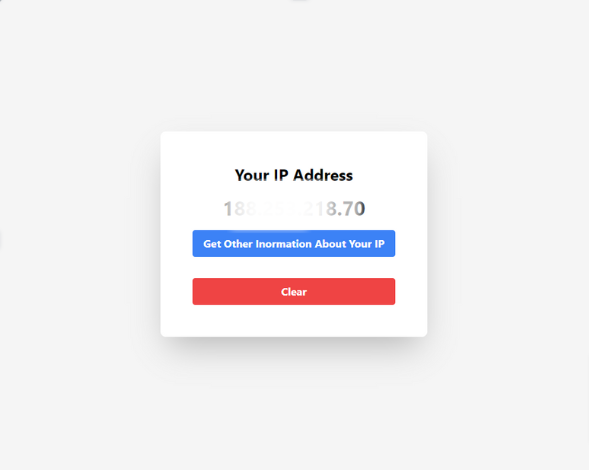

# IP Address Learner

IP Address Learner is a web application built with React that helps users learn about IP addresses, including their types and usage.





## Features

- **IP Address Information:** Learn about the different types of IP addresses, including IPv4 and IPv6.
- **Geolocation:** Find the geolocation information associated with an IP address.
- **IP Address Validation:** Validate IP addresses to ensure they are formatted correctly.
- **Responsive Design:** Works well on both desktop and mobile devices.

## Installation

1. Clone the repository

```bash
git clone https://github.com/aladdinalizada/speed-tester
```
2. Navigate into the project directory:
```bash
cd speed-tester
```
3. Install dependencies:
```bash
npm install
```
4. Start the development server:
```bash
npm run dev
```


Open your browser and go to http://localhost:5173 to view the app.
